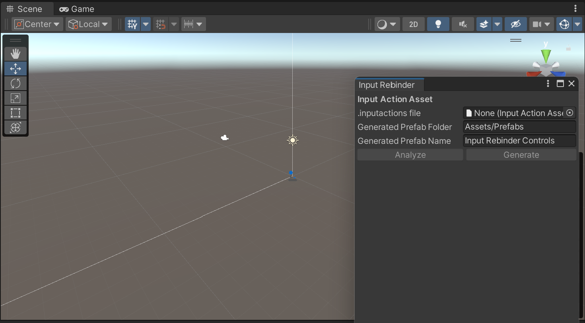
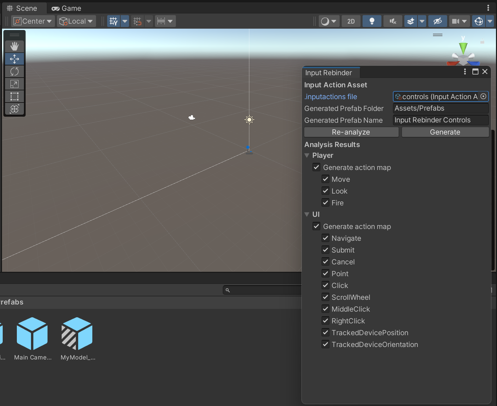
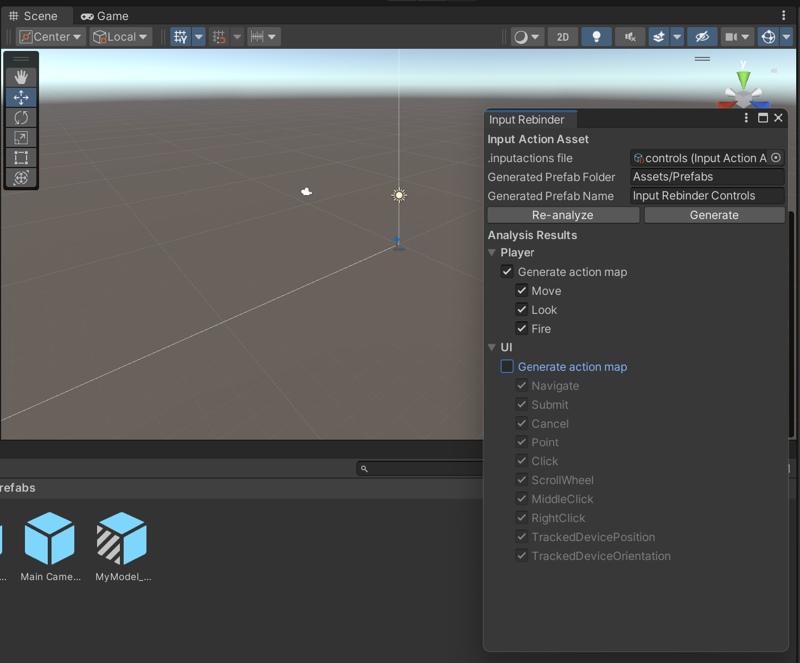
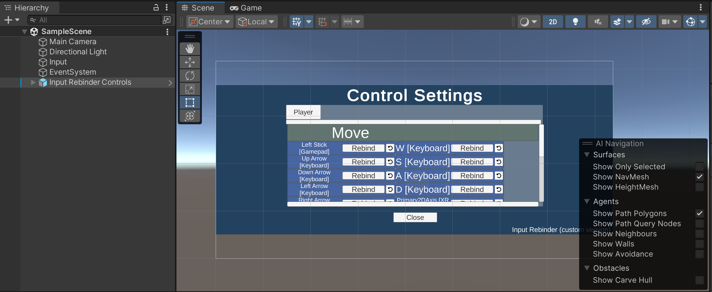

# Getting Started

## Importing
To import this package in your project, you need to use Unity's package manager ("Window" > "Package Manager"). From there, follow the instructions for your situation. If the package is already on your disk, click "Add package from disk...". Otherwise, you need to acquire the package from the Asset Store.

## Generate an in-game UI
### Step 1
Go to "Tools" > "Input Rebinder". This will open the editor plugin's window.

### Step 2
On the opened editor window, select your `.inputactions` file. This is a file that Unity generates when you use the Input System. To select, click the rounded symbol with a dot inside.

_Note_: The Input Rebinder plugin comes with some `.inputactions` file, namely `Empty` and `One`. They are used for testing only.

### Step 3
In `Generated Prefab Folder`, select where you want the prefab to be generated in your project. By default, it is "Assets/Prefabs" and it will create the folders if they don't exist.

### Step 4
In `Generated Prefab Name`, write the name of the prefab that will be generated by the Input Rebinder plugin. By default, the name is "Input Rebinder Controls".

### Step 5
Click `Analyze`.

### Step 6
Pick which actions and action maps you want the plugin to generate. Usually, the UI action map is deselected because you don't want players to change the in-game UI's event system.

### Step 7
Click `Generate`. A prefab _variant_ is generated at your desired location. A prefab variant is an instance of another prefab that is instantiable by itself. You may detach the prefab variant after you have finished using the plugin. 

### Step 8
Place the generated prefab into a scene. Click `2D` in the editor to see in-game UI instead of the 3D world. 

### Step 9
To integrate your game, there are many ways and it depends on you. For example, you may disable the prefab and write a script that enables the generated prefab when a game event occurs. Or you may place the generated prefab alone in a scene that is switched into.

By default, the `Close` button on the prefab disables the root of the prefab. You can modify its behavior by changing its attached listener in the inspector. 